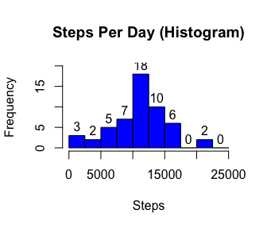
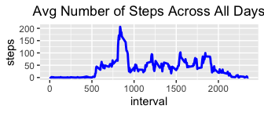
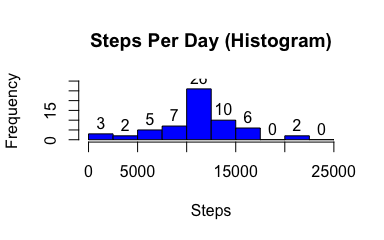
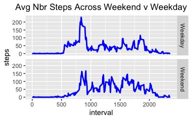

---
output:
  html_document:
    keep_md: yes
---


# Loading and processing the data

1. Load the data


```r
getwd()
list.files()
# install.packages("zip")
# load the zip package
library("zip")
```

```
## 
## Attaching package: 'zip'
```

```
## The following objects are masked from 'package:utils':
## 
##     unzip, zip
```

```r
# Unzip the data file
unzip("repdata_data_activity.zip")
# Read the activity data file 
activity_data <- read.csv("activity.csv")
```

2. Process/transform the data (if necessary) into a format suitable for your analysis


```r
# Processed the data and transformed the data into a suitable table for analysis
# print(head(activity_data, 5), type="html")
# Preview the activity data
str(activity_data)
```

```
## 'data.frame':	17568 obs. of  3 variables:
##  $ steps   : int  NA NA NA NA NA NA NA NA NA NA ...
##  $ date    : Factor w/ 61 levels "2012-10-01","2012-10-02",..: 1 1 1 1 1 1 1 1 1 1 ...
##  $ interval: int  0 5 10 15 20 25 30 35 40 45 ...
```

```r
# unique(activity_data$steps)
# unique(activity_data$date)
# unique(activity_data$interval)
```


There are 3 variables in this dataset. They are steps, date, interval.

# What is mean total number of steps taken per day?

For this part of the assignment, you can ignore the missing values in the dataset.

1. Calculate the total number of steps taken per day


```r
# This step is done to aggregate the activity data by date for the average steps
Steps_per_day <- setNames(aggregate(activity_data$steps, by=list(activity_data$date), FUN=sum), c("Date", "Steps"))
# Steps_per_day <- data.frame(Steps_per_day)
# Steps_per_day$Steps <- as.numeric(Steps_per_day$Steps)
# str(Steps_per_day)
# Here a sample of the aggregated data
# head(Steps_per_day, 5)
# This step is used to calculate the number of observations with NAs v. without NAs
nrow(subset(Steps_per_day, is.na(Steps_per_day$Steps)=="TRUE"))
```

```
## [1] 8
```

```r
nrow(subset(Steps_per_day, is.na(Steps_per_day$Steps)=="FALSE"))
```

```
## [1] 53
```

2. If you do not understand the difference between a histogram and a barplot, research the difference between them. Make a histogram of the total number of steps taken each day


```r
# Create histogram to analyze the range of steps taken per day
activity_graph <- hist(Steps_per_day$Steps, main= "Steps Per Day (Histogram)", xlab = "Steps", col = "blue", breaks = seq(0, 25000, 2500), xlim = c(0, 25000), ylim = c(0,20))
text(activity_graph$mids, activity_graph$counts, labels = activity_graph$counts, adj = c(.5,-.5))
```

<!-- -->

3. Calculate and report the mean and median of the total number of steps taken per day


```r
# Apply the mean and median functions to the steps per day data. NAs removed in calculation.
mean(Steps_per_day$Steps, na.rm = TRUE)
```

```
## [1] 10766.19
```

```r
median(Steps_per_day$Steps, na.rm = TRUE)
```

```
## [1] 10765
```

# What is the average daily activity pattern?

1. Make a time series plot (i.e. \color{red}{\verb|type = "l"|}type="l") of the 5-minute interval (x-axis) and the average number of steps taken, averaged across all days (y-axis)


```r
# This step is done to aggregate the activity data by interval for the average steps
Steps_per_time <- aggregate(steps~interval, data=activity_data, FUN = mean, na.action = na.omit)
# head(Steps_per_time, 5)
# Load the ggplot2 package
library("ggplot2")
# Create a line graph plot to illustrate the average number of steps taken for each 5-minute interval accross all days
ggplot(data = Steps_per_time, aes(x = interval, y = steps)) + geom_line(color = "blue", size = 1) + ggtitle("Avg Number of Steps Across All Days") + theme(plot.title = element_text(hjust = 0.5))
```

<!-- -->

2. Which 5-minute interval, on average across all the days in the dataset, contains the maximum number of steps?


```r
# Subset the data to determine, on average across all the days in the dataset, which interval has the maximum number of steps
subset(Steps_per_time, Steps_per_time$steps == max(Steps_per_time$steps))
```

```
##     interval    steps
## 104      835 206.1698
```

# Imputing missing values

Note that there are a number of days/intervals where there are missing values (coded as \color{red}{\verb|NA|}NA). The presence of missing days may introduce bias into some calculations or summaries of the data.

1. Calculate and report the total number of missing values in the dataset (i.e. the total number of rows with \color{red}{\verb|NA|}NAs)


```r
# Use the sum function to determine the total number of missing records in the activity dataset.
NA_count <- sum(is.na(activity_data))
```

There are 2304 NAs in this dataset.

2. Devise a strategy for filling in all of the missing values in the dataset. The strategy does not need to be sophisticated. For example, you could use the mean/median for that day, or the mean for that 5-minute interval, etc.

I chose to replace the NAs with the mean for that 5-minute interval. Below is a sample of the updated data.


```r
# Subset activity data to create a new dataset with NA observations.
Sub_NAs <- subset(activity_data, is.na(activity_data$steps)==TRUE, select = c("interval", "date"))
# Sub_NAs
# Merge NA subset dataset with steps_per_time dataset.
Replace_NAs <- merge(Sub_NAs, Steps_per_time, by = "interval", all.x = TRUE)
# Reorder columns
Order_NAs <- Replace_NAs[c("steps", "date", "interval")]
Order_NAs$steps <- round(Order_NAs$steps, 0)
# head(Order_NAs, 5)
```

3. Create a new dataset that is equal to the original dataset but with the missing data filled in.


```r
# Subset activity data to remove NA observations.
Sub_NonNAs <- subset(activity_data, is.na(activity_data$steps)==FALSE)
# Combine activity data without NAs with the missing data filled in.
Updated_activity_data <- rbind(Sub_NonNAs, Order_NAs)
# Determine that the changes were made correctly
# unique(Updated_activity_data$steps)
str(Updated_activity_data)
```

```
## 'data.frame':	17568 obs. of  3 variables:
##  $ steps   : num  0 0 0 0 0 0 0 0 0 0 ...
##  $ date    : Factor w/ 61 levels "2012-10-01","2012-10-02",..: 2 2 2 2 2 2 2 2 2 2 ...
##  $ interval: int  0 5 10 15 20 25 30 35 40 45 ...
```

4. Make a histogram of the total number of steps taken each day and Calculate and report the mean and median total number of steps taken per day. Do these values differ from the estimates from the first part of the assignment? What is the impact of imputing missing data on the estimates of the total daily number of steps?

The mean and median did change. However, the changes are minimal.The mean decreased by less than 1 and the median is lower by 3.


```r
# Aggregate the updated activity data (NAs replaced with 5-minute interval average steps)
Updated_steps_per_day <- setNames(aggregate(Updated_activity_data$steps, by=list(Updated_activity_data$date), FUN=sum), c("Date", "Steps"))
# Generate a histogram, mean and median to determine what, if any, changes occurred as a result of replacing NAs
Updated_activity_graph <- hist(Updated_steps_per_day$Steps, main= "Steps Per Day (Histogram)", xlab = "Steps", col = "blue", breaks = seq(0, 25000, 2500), xlim = c(0, 25000), ylim = c(0,30))
text(Updated_activity_graph$mids, Updated_activity_graph$counts, labels = Updated_activity_graph$counts, adj = c(.5,-.5))
```

<!-- -->

```r
mean(Updated_steps_per_day$Steps, na.rm = TRUE)
```

```
## [1] 10765.64
```

```r
median(Updated_steps_per_day$Steps, na.rm = TRUE)
```

```
## [1] 10762
```

# Are there differences in activity patterns between weekdays and weekends?

For this part the \color{red}{\verb|weekdays()|}weekdays() function may be of some help here. Use the dataset with the filled-in missing values for this part.

1. Create a new factor variable in the dataset with two levels – “weekday” and “weekend” indicating whether a given date is a weekday or weekend day.


```r
# Format the date field so that in can be used to calculate day of week
Updated_activity_data$date_formatted <- as.Date(Updated_activity_data$date, format = "%Y-%m-%d")
# Use the weekdays function to create a new column with day of the week for each formatted date
Updated_activity_data$day_of_week <- weekdays(Updated_activity_data$date_formatted)
# Use ifelse function to group and assign day of the week to either weekday or weekend
Updated_activity_data$day_type <- ifelse(Updated_activity_data$day_of_week == "Saturday" | Updated_activity_data$day_of_week == "Sunday", "Weekend", "Weekday")
# head(Updated_activity_data, 5)
```

2. Make a panel plot containing a time series plot (i.e. \color{red}{\verb|type = "l"|}type="l") of the 5-minute interval (x-axis) and the average number of steps taken, averaged across all weekday days or weekend days (y-axis). See the README file in the GitHub repository to see an example of what this plot should look like using simulated data.


```r
# Aggregate the data to show the average steps taken by 5-minute interval on weekdays and weekends
Steps_per_time_wk <- aggregate(steps~interval+day_type, data=Updated_activity_data, FUN = mean, na.action = na.omit)
# Sample of mean data
# head(Steps_per_time_wk, 5)
# Plot the data using line graphs
ggplot(data = Steps_per_time_wk, aes(x = interval, y = steps)) + geom_line(color = "blue", size = 1) + facet_grid(rows = vars(day_type)) + facet_grid(rows = vars(day_type)) + ggtitle("Avg Nbr Steps Across Weekend v Weekday") + theme(plot.title = element_text(hjust = 0.5))
```

<!-- -->
